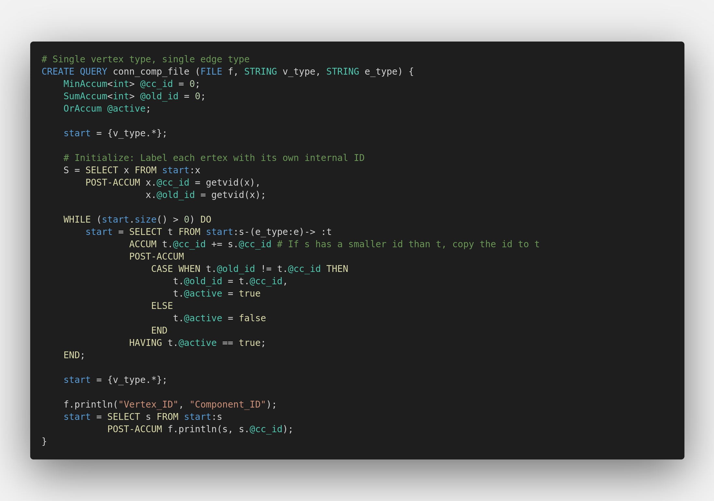
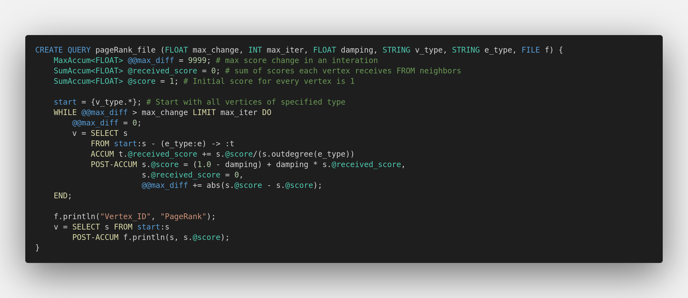

# VSC GSQL Extension

This extensions provides syntax highlighting capabilities for TigerGraph's GSQL. This is mostly hacked together from:
* [alejandropoveda/atom-language-gsql](https://github.com/alejandropoveda/atom-language-gsql)
* [jmeekhof/gsql-vim](https://github.com/jmeekhof/gsql-vim)
* [fjblau/gsql-sublime](https://github.com/fjblau/gsql-sublime)

NOTE! This is still in development and has quite a bit of work and testing to do

## Installation

#### Option 1:
VSCode Marketplace
https://marketplace.visualstudio.com/items?itemName=DavidBakerEffendi.vsc-gsql-extension

#### Option 2:
Using the Preferences -> Extensions Menu -> Search Extensions in Marketplace

## Features

Planned features are linting and auto-formatting. So far we have basic syntax highlighting working.

### Syntax Highlighting

`syntaxes/gsql.tmLanguage.json` contains a ported version of [alejandropoveda/atom-language-gsql](https://github.com/alejandropoveda/atom-language-gsql)'s specification of GSQL's language spec.

### Linting

TODO: Implement GSQL linting TypeScript from GraphStudio code given to me by @jonherke

## Contributing

### Submitting a new issue

There are two templates namely:
- [Feature Requests](./.github/ISSUE_TEMPLATE/feature_request.md): These are used for any features/enhancements you would like to see and includes any documentation that needs to be added.
- [Bug Report](./.github/ISSUE_TEMPLATE/bug_report.md): This is for reporting any bugs - self explanatory!

### Making a change

Please consult [CONTRIBUTING](./CONTRIBUTING.md) for more details on contributing to this project.

## Release Notes

For a more detailed list of changes please see the [CHANGELOG](./CHANGELOG.md).

### 0.0.x

- Initial release
- Basic syntax highlighting ported across from the Atom extension
- Simplified accumulator regex to fix matching whole accumulator with type parameter
- Lowered required VSCode version to ^1.0.0
- Updated description to match README on the repository